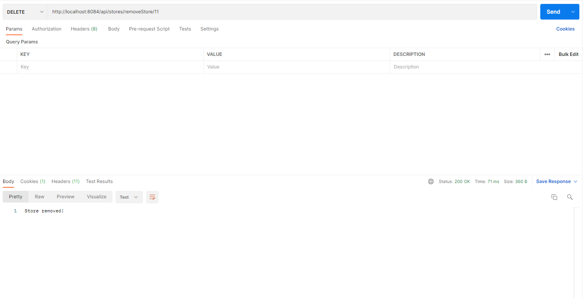
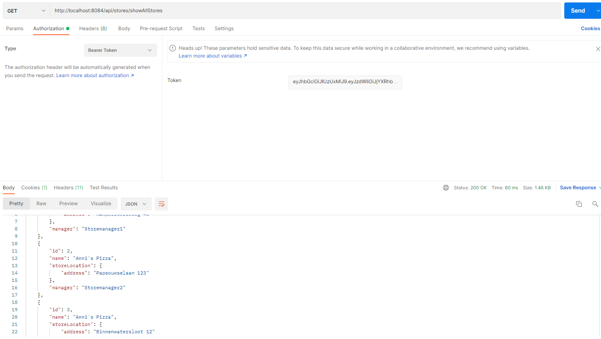
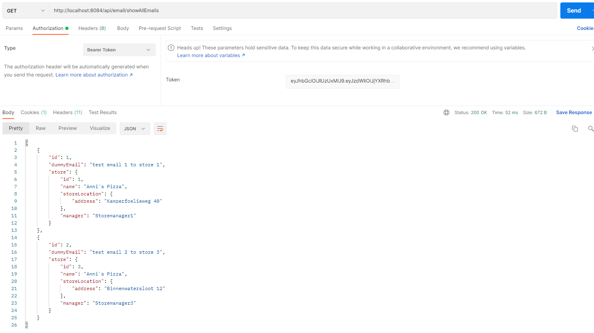
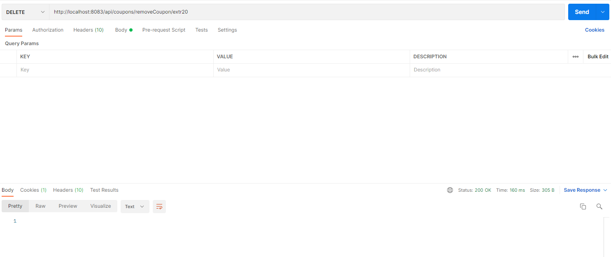
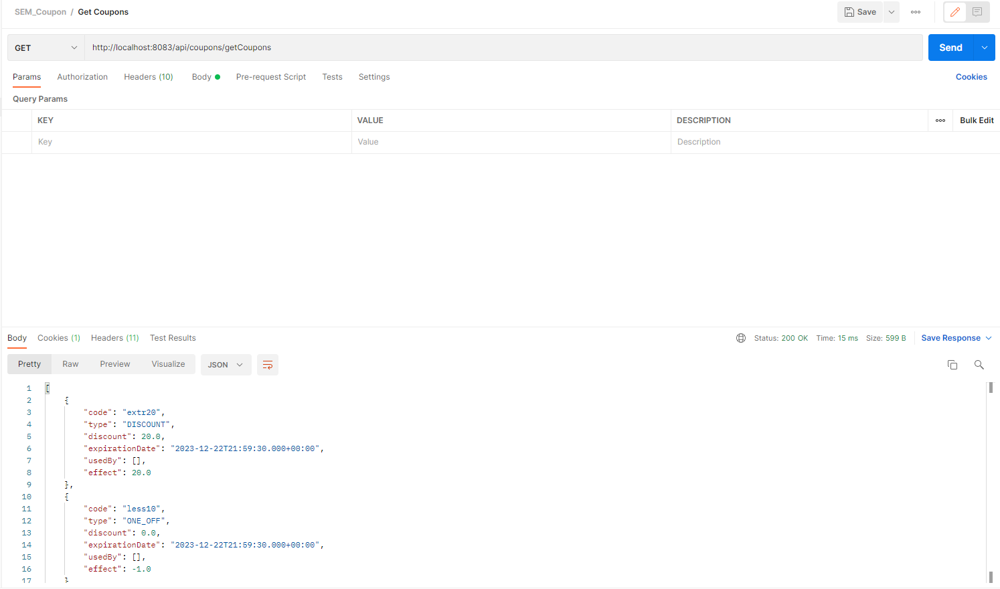
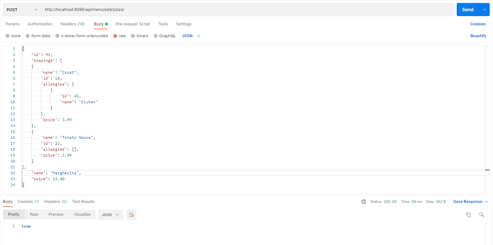
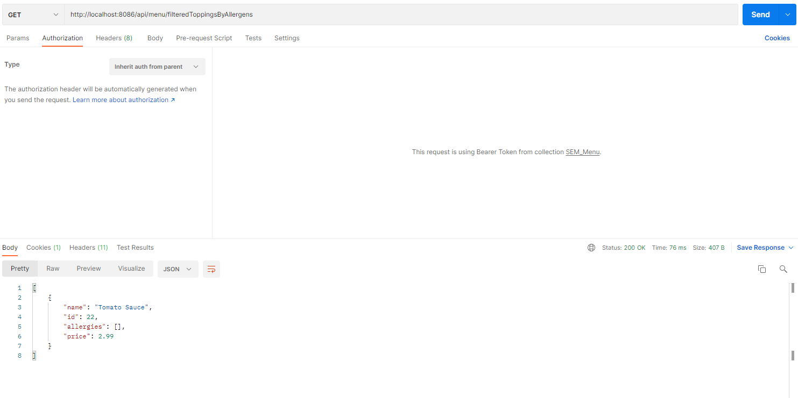
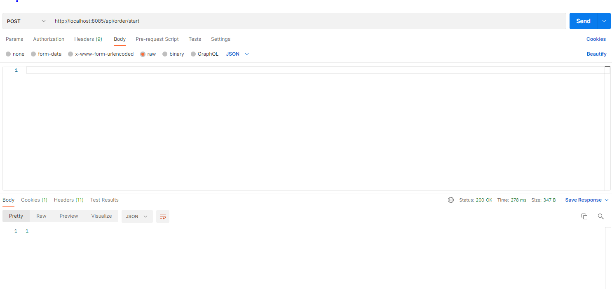
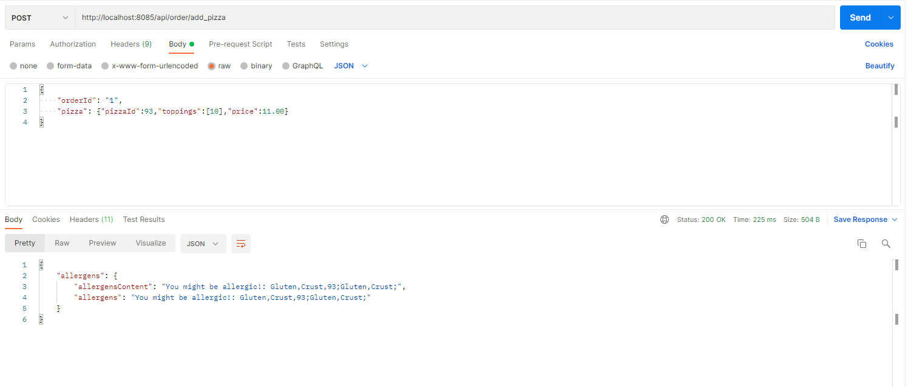
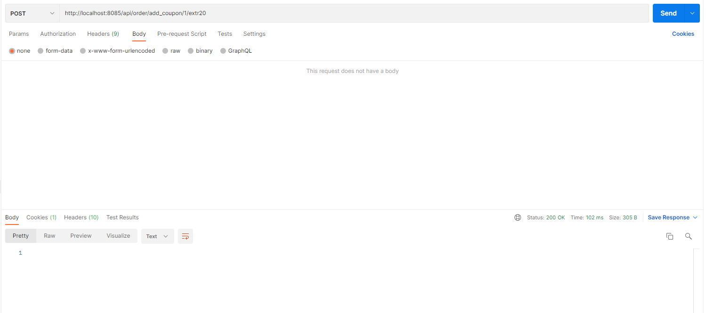

# Project: Anni's Pizza

This project contains six microservices:
- authentication-microservice
- coupon-microservice
- menu-microservice
- order-microservice
- store-microservice
- user-microservice

The `authentication-microservice` is responsible for registering new users and authenticating current ones. After successful authentication, this microservice will provide a JWT token which can be used to bypass the security on the other microservices. This token contains the *memberId* of the user that authenticated.

The `coupon-microservice` is responsible for validating coupon codes and for choosing the best coupon code for minimizing order type. This microservice allows new coupon codes to be added and also to take a possible order and to check if a coupon code gives a better price and return the new price.

The `menu-microservice` is responsible for providing all available assortments of pizza that are available for ordering, while allowing configuring items with customizable toppings and also filtering out or warning users in case of allergens present.

The `order-microservice` is responsible for handling orders. It stores ongoing, placed, finished and canceled orders in a database.
The order microservice also collects order details. First it collects the order time and location. If the location is not provided the Order will query the Users for the preferred location.

The `store-microservice` is responsible for keeping track of possible store locations. This microservice allows the regional manager to add new or remove existing stores. The store microservice is also responsible for encapsulating dummy email functionality.

The `user-microservice` is responsible for keeping track of allergies that the user has and the location of their preferred store. The user is authenticated using the token given from the authentication microservice. The allergens are queried by the menu and order microservices in order to filter out items or notify the user that they might be allergic to the item.

The `domain` and `application` packages contain the code for the domain layer and application layer. The code for the framework layer is the root package as *Spring* has some limitations on were certain files are located in terms of autowiring.

## Running the microservices

You can run the microservices individually by starting the Spring applications. Then, you can use *Postman* to perform the different requests:

### Step 1: Authentication
#### Register:

#### Authenticate:
In case you are a regional manager, change the role first:

In case you are a store manager, register with the name `StoremanagerX`, where instead of X you put the id of the store you're an admin of. Then change the role to `store_manager`. Then authenticate.

### Step 2: User Registration (If you are a customer)
As a customer, you can set your allergens in your details so that you don't have to manually add them every time you order. 

#### To do this, first you add the allergens: 

#### You can also remove any allergen:

#### You are able to see all of your selected allergens:

### Step 3: Adding stores to database (If you are a regional manager)
By default, we store 10 stores on the database

To add/delete stores you have to be a regional manager.

#### Adding stores:

#### Deleting stores:

#### Viewing all stores:

#### Sending emails:

#### Viewing emails of a specific store:

#### Viewing emails of all stores:

### Step 4: Adding coupons to database (If you are a regional manager)
To add/delete coupons you have to be a regional manager. 
You can add coupons either in the form of a "discount", or a "one off" (get the most expensive item from order for free)

#### Adding coupons:

#### Deleting coupons:

#### Viewing all coupons:

### Step 5: Adding toppings and pizza's to the menu (If you are a regional manager)
To add/delete toppings and pizzas from the menu you have to be a regional manager.

#### Adding allergen:

#### Adding toppings (possibly containing allergens):

#### Removing toppings:

#### Viewing all toppings:

#### Adding pizzas:

#### Removing pizzas:

#### Viewing all pizzas:

#### Filter all toppings by user's allergens:

#### Filter all pizzas by user's allergens:

### Step 6: Ordering

As a customer, this is the process of ordering.

#### Starting an order:

#### Setting the location of an order (it has to be the location of a valid store):

#### Setting the desired time of an order:

#### Adding a pizza to an order:

#### Removing a pizza from an order:

#### Editing a pizza (By adding/removing toppings from it):

Adding topping:

Removing topping:

#### Placing an order:

#### Cancelling an order:

#### Applying a coupon to an order (it has to be a valid coupon):

